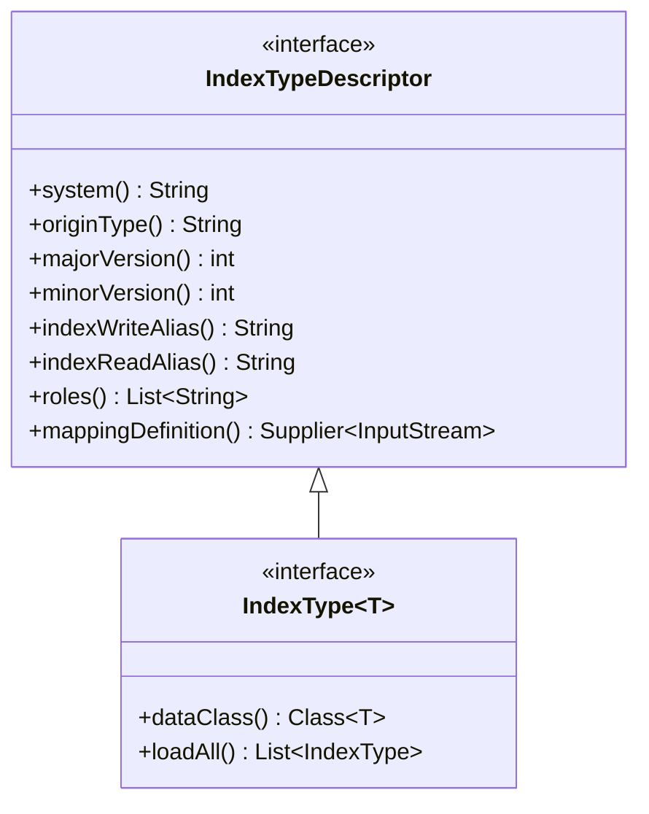

# Domain model

This library provides the core contracts and data structures shared by all components of the jEAP
OpenSearch ecosystem: the index writer service, the search client starter, the SearchItem API, and
the index type registry Maven plugin.

## Type hierarchy



## Key types

| Type                   | Description                                                                                                                                                                                                       |
|------------------------|-------------------------------------------------------------------------------------------------------------------------------------------------------------------------------------------------------------------|
| `IndexTypeDescriptor`  | Non-generic descriptor: system, origin type, versions, alias names, roles, and mapping. Used in APIs that do not need the typed data class.                                                                       |
| `IndexType<T>`         | Extends `IndexTypeDescriptor` with `dataClass()` — the concrete Java type for the `data` field. Used by the index writer (for write deserialization) and by the search client (for typed result deserialization). |
| `Origin`               | Business object metadata: `id`, `version`, `bp_id`, `tenant`, `created`, `modified`, and a provider-specific `reference`. Written to the `origin` field of every OpenSearch document.                             |
| `SearchItem<T>`        | Pairs an `Origin` with typed business data `T`. Returned by the SearchItem Provider API and consumed by the index writer.                                                                                         |
| `SearchItemIndexed<T>` | Extends `SearchItem<T>` with `SearchItemMetadata` — the metadata written by the index writer to the `search_item` field. Returned by the search client.                                                           |
| `SearchItemMetadata`   | `upserted_at` timestamp, `major_version`, and `minor_version` stored in the `search_item` field of every OpenSearch document.                                                                                     |
| `MappingVersion`       | Pairs a `majorVersion` and `minorVersion` with a reference to the corresponding mapping JSON file.                                                                                                                |

## IndexTypeDescriptor interface

```java
public interface IndexTypeDescriptor {
    String system();           // e.g. "JME"
    String originType();       // e.g. "JmeDecreeDocument"
    int    majorVersion();     // breaking schema version
    int    minorVersion();     // backwards-compatible schema version
    String indexWriteAlias();  // e.g. "jme_decree_document_v1_write"
    String indexReadAlias();   // e.g. "jme_decree_document_read"
    List<String> roles();      // jEAP roles required to read this index type
    Supplier<InputStream> mappingDefinition(); // OpenSearch mapping JSON
}
```

## IndexType interface

`IndexType<T>` extends `IndexTypeDescriptor` with the typed data class:

```java
public interface IndexType<T> extends IndexTypeDescriptor {
    Class<T> dataClass();  // e.g. JmeDecreeDocumentDataV1.class

    // Discovers all IndexType implementations via ServiceLoader
    static List<IndexType<?>> loadAll() { ... }
    static List<IndexType<?>> loadAll(ClassLoader classLoader) { ... }
}
```

## Origin

```java
public class Origin {
    String  id;        // unique business object identifier
    String  version;   // version string of the business object
    String  bpId;      // business partner identifier
    String  tenant;    // tenant identifier (may be null)
    Instant created;   // creation timestamp
    Instant modified;  // last-modified timestamp
    Object  reference; // provider-specific reference data (not indexed in OpenSearch)
}
```

## SearchItem

```java
public class SearchItem<T> {
    Origin origin;  // business object metadata
    T      data;    // typed business data defined by the IndexType
}
```

## SearchItemMetadata

Written to the `search_item` field of every document by the index writer service:

```java
public class SearchItemMetadata {
    Instant upsertedAt;    // timestamp of the index write
    int     majorVersion;  // major version of the IndexType mapping used at write time
    int     minorVersion;  // minor version of the IndexType mapping used at write time
}
```

## Related

- [Getting started](getting-started.md)
- [jeap-opensearch-index-type-registry-maven-plugin](https://github.com/jeap-admin-ch/jeap-opensearch-index-type-registry-maven-plugin)
- [jeap-opensearch-index-type](../README.md)
